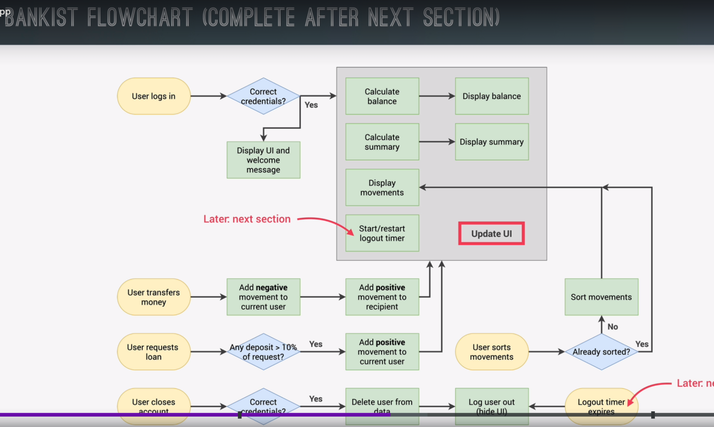

# W

> Actual projet files be located here

# Workflow

# Upload Info

> This will be uploaded to verPUcel since you have account lick ass

# CurrentDeploy

[`https://mx-uj-s11-pjb-2.vercel.app/`](https://mx-uj-s11-pjb-2.vercel.app/)
